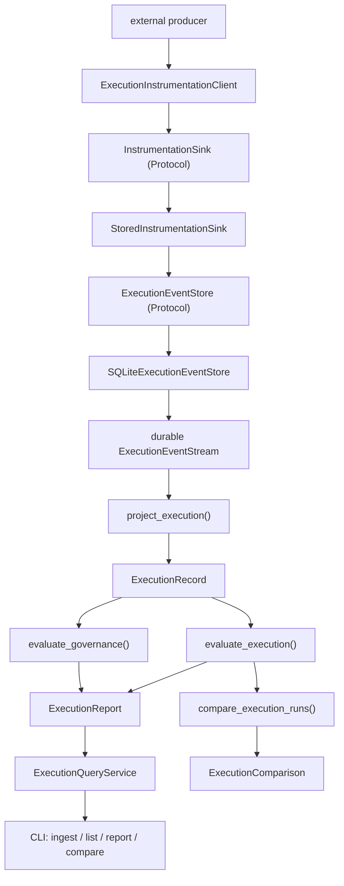

# Agent Control Plane

Agent Control Plane is a provider-neutral execution observability, governance, evaluation, and
regression control plane for AI-assisted software workflows. It records typed execution events,
reconstructs deterministic execution state from that history, evaluates configured governance
and behavioral expectations against it, compares baseline and candidate runs, and provides local
durable query and reporting. It does not own the workflow it observes.

## Why this exists

AI-assisted engineering systems often expose provider logs or conversational traces, but those
do not by themselves give you explicit execution semantics, capability visibility, human
approval facts, deterministic governance, deterministic behavioral evaluation, run-to-run
regression comparison, or replayable durable history. This project models execution behavior
directly, as typed steps, capability invocations, human interactions, and decisions, instead of
treating a conversation log as the primary system record.

## Design principles

- execution semantics over chat transcripts: no `AgentMessage`, `Conversation`, or `ChatTurn`
- immutable, append-only event history as the single durable source of truth
- deterministic projection: the same event stream always yields the same snapshot
- exact idempotency: duplicate delivery of an identical event is a no-op, not an error
- explicit producer state: no contextvars, no hidden current execution, no decorators
- governance is observational: a violation records what happened, it does not block anything
- evaluation is a separate concern from governance, never merged into one status
- honest `INDETERMINATE` states instead of presenting missing data as a pass
- provider-neutral core: no model SDK, no specific producing system's domain knowledge
- reports are derived views, never a second authoritative persisted representation

## Architecture



Events are the durable source of truth. `ExecutionRecord`, `GovernanceReport`,
`EvaluationReport`, and `ExecutionComparison` are all derived: none of them are persisted, and
recomputing any of them from the same event history and the same configuration always produces
the same result. See [docs/architecture.md](docs/architecture.md) for the full package and
dependency map.

## Execution model

An `ExecutionRecord` is an immutable snapshot: an `execution_id`, `system_id`, `workflow_name`,
lifecycle `status`, timestamps, an optional domain `outcome`, and a flat tuple of
`ExecutionStep`s connected through `parent_step_id` rather than nested child objects. Each step
has a `StepKind` (`WORKFLOW`, `MODEL`, `CAPABILITY`, `HUMAN`, `DECISION`) and exactly the typed
detail that kind requires: a `ModelInvocation`, `CapabilityInvocation`, `HumanInteraction`, or
`DecisionRecord`. All timestamps are caller-supplied and timezone-aware; nothing in the core
calls `datetime.now()`. There is no raw prompt or model response capture anywhere in the domain,
only bounded invocation identity and usage counts.

## Event ingestion

An execution is a sequence of typed events: `ExecutionStartedEvent`, `StepStartedEvent`,
`StepCompletedEvent`, `StepFailedEvent`, `StepCancelledEvent`, `ExecutionCompletedEvent`,
`ExecutionFailedEvent`, `ExecutionCancelledEvent`. Each event carries a producer-supplied
`event_id`, `execution_id`, `sequence`, and `occurred_at`; `sequence` is the control plane's own
logical ordering per execution and is never derived from `occurred_at`. Appending an event with
an `event_id` and content that exactly matches one already accepted is a no-op (`DUPLICATE`);
the same `event_id` with different content is a conflict. A stream cannot reopen once a terminal
execution event has been accepted. A stream that `append_execution_event` accepts always
projects successfully; that guarantee is what the durable store and the instrumentation client
both build on.

## Instrumentation SDK

`ExecutionInstrumentationClient` is the producer-facing entry point. The caller holds an
immutable `InstrumentationSession`; every client method takes a session and, on success, returns
a new one, deriving the next sequence from what that session has already seen. `event_id` and
`occurred_at` are always caller-supplied, never generated, because a producer that is unsure
whether a delivery succeeded must be able to retry with the exact same event to get exact
idempotency rather than creating a second, unrelated event. Session state only advances after
the sink acknowledges the event; a delivery failure leaves the caller's session untouched. One
client instance can service any number of independent sessions concurrently. There are no
contextvars, no decorators, and no hidden current span anywhere in this SDK.

## Governance

`evaluate_governance(stream, policy_set)` returns `PASS`, `VIOLATION`, or `INDETERMINATE` per
configured policy, and an aggregate for the whole `GovernanceReport`. Governance is strictly
observational: a `VIOLATION` records that observed behavior violated a configured policy, it
does not mean the control plane blocked or could have blocked the underlying action. Current
policy types:

- `CapabilityBoundaryPolicy`: flags capability activity in a denied mode/scope
- `HumanApprovalRequirementPolicy`: requires a completed human approval, by logical sequence,
  before matching capability use
- `ModelUsageBudgetPolicy`: an execution-level usage ceiling over matching model steps

## Evaluation

`evaluate_execution(stream, expectation_set)` returns `PASS`, `FAIL`, or `INDETERMINATE` per
declared expectation. Evaluation asks whether observed behavior matched a declared scenario, a
different question from governance's "was policy violated." There is no LLM judge and no
semantic scoring anywhere in this path: every expectation matches typed facts exactly. Current
expectation types:

- `ExecutionStatusExpectation`, `ExecutionOutcomeExpectation`
- `StepOccurrenceExpectation`, `CapabilityOccurrenceExpectation`
- `HumanInteractionExpectation`

Governance and evaluation never call into each other, and a report can legitimately show a
governance `VIOLATION` next to an evaluation `PASS`: a behavior can be exactly what a scenario
expected while still violating organizational policy. See
[docs/governance-and-evaluation.md](docs/governance-and-evaluation.md) for a worked example.

## Regression comparison

`compare_execution_runs(baseline, candidate)` classifies each declared expectation's transition
between two runs (`UNCHANGED`, `REGRESSED`, `IMPROVED`) and aggregates to `UNCHANGED`,
`REGRESSION`, `IMPROVEMENT`, or `MIXED`. This classification comes only from expectation status
transitions. Descriptive deltas (step counts, usage) ride alongside the classification for a
human to read; they are never interpreted as "better" or "worse" on their own, and there is no
composite score.

## Persistence and query

`ExecutionEventStore` is a provider-neutral port; `SQLiteExecutionEventStore` is the local
reference adapter, backed by one append-only event table. Each `append` runs inside a single
`BEGIN IMMEDIATE` transaction that reads the current stream, validates the candidate through the
real event-lifecycle logic, and inserts only for a genuinely new event, so durable history stays
consistent under concurrent writers. The durable source of truth remains the event table; no
snapshot or report is ever persisted. Query and reporting currently load and project every
stored execution in application code before filtering, a tradeoff appropriate for local/reference
scale rather than a claim about arbitrary distributed-scale storage. See
[docs/persistence-and-concurrency.md](docs/persistence-and-concurrency.md) for the transaction
design and concurrency semantics in full.

## CLI

```
agent-control-plane --db control.db ingest event.json
agent-control-plane --db control.db ingest -
agent-control-plane --db control.db list --system-id sys --status completed --json
agent-control-plane --db control.db report exec-1 --policy-set policies.json --expectation-set expectations.json
agent-control-plane --db control.db compare baseline-exec candidate-exec --expectation-set expectations.json
```

`--db` is required and explicit; nothing defaults to a hidden location. `--json` is a per-command
flag whose stdout is exactly the underlying model's JSON, with nothing else on stdout and no
mixing with stderr. A governance `VIOLATION`, an evaluation `FAIL`, or a comparison `REGRESSION`
is a successful command result, not a CLI failure: `report` and `compare` exit `0` whenever they
produce a valid result, and use distinct nonzero codes only for invalid input (`2`), operational
conflicts (`1`), and a missing execution (`3`).

## Reference scenario

`examples/load_reference_runs.py` emits two deterministic executions through the real
instrumentation SDK: `arb-reference-baseline` and `arb-reference-candidate`. Every ID and
timestamp is fixed, so rerunning the script against the same database is safe and simply
receives `DUPLICATE` for every event. Against `examples/policy_set.json` (deny `EXECUTE`
capability activity) and `examples/expectation_set.json` (five model steps, zero `EXECUTE`
calls, one decision, `outcome="request_changes"`):

| | baseline | candidate |
|---|---|---|
| governance | PASS | VIOLATION |
| evaluation | PASS | FAIL |

Comparing them yields `REGRESSION`. `system_id="architecture-review-board"` and
`workflow_name="architecture-review"` here are only an example producer identity; the control
plane has no source-level dependency on that or any other specific producing system.

## Installation

```bash
pip install -e .
```

For development:

```bash
pip install -e ".[dev]"
```

No optional model provider SDK is required by the core package.

## Quick start

```bash
python examples/load_reference_runs.py /tmp/control-plane.db
agent-control-plane --db /tmp/control-plane.db list
agent-control-plane --db /tmp/control-plane.db report arb-reference-baseline \
    --policy-set examples/policy_set.json --expectation-set examples/expectation_set.json
agent-control-plane --db /tmp/control-plane.db report arb-reference-candidate \
    --policy-set examples/policy_set.json --expectation-set examples/expectation_set.json
agent-control-plane --db /tmp/control-plane.db compare arb-reference-baseline arb-reference-candidate \
    --expectation-set examples/expectation_set.json
```

## Development

```bash
ruff check src tests examples
mypy src --strict
pytest -q
```

## Project scope

See [PROJECT_SCOPE.md](PROJECT_SCOPE.md) for the precise, maintained boundary of what v0.1.0
includes and deliberately excludes.

## Status

v0.1.0 release candidate. This is a reference implementation and portfolio project; it has no
production deployment history.
