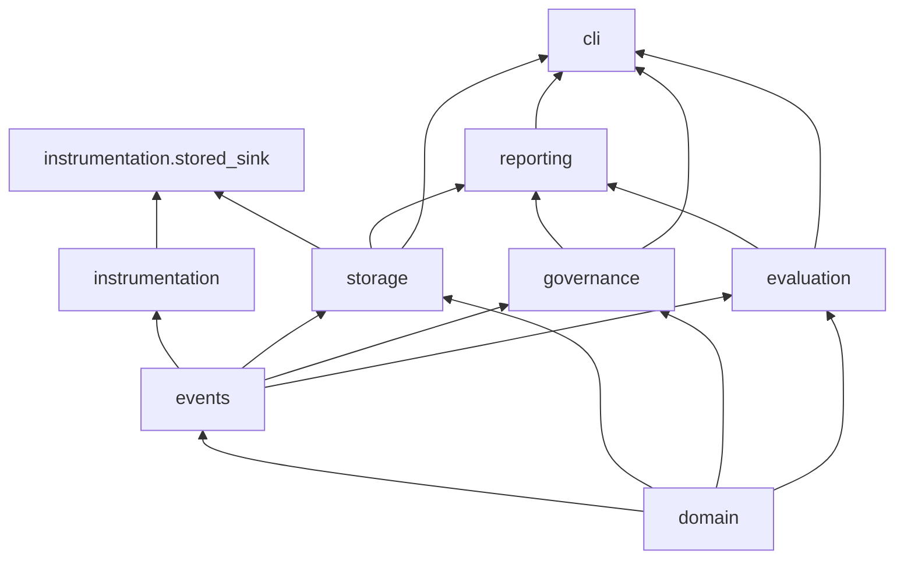

# Architecture

This document describes the implementation as it exists in v0.1.0, not an aspirational future
system.

## 1. Responsibilities

Agent Control Plane records typed execution events for AI-assisted workflows, reconstructs
deterministic execution state from that history, evaluates configured governance policies and
behavioral expectations against it, compares baseline and candidate runs, and exposes local
durable query and reporting. It does not execute workflow actions, does not call a model, and
does not own the workflow it observes. The observed system remains authoritative for its own
domain.

## 2. Package and layer map

```
src/agent_control_plane/
    domain/          typed immutable execution snapshot: ExecutionRecord, ExecutionStep, ...
    events/          typed ExecutionEvent union, ExecutionEventStream, append/projection
    instrumentation/ producer-facing client, session, sink contract, stored sink adapter
    storage/         provider-neutral ExecutionEventStore port, SQLite reference adapter
    governance/      policy models and evaluate_governance()
    evaluation/       expectation models, evaluate_execution(), compare_execution_runs()
    reporting/       ExecutionQueryService: query, get_execution, build_report
    cli/             argparse-based CLI over the application services above
```

`domain` and `events` have no dependency on anything else in the package. Every other package
depends on one or both of them. `governance` and `evaluation` are siblings: neither imports the
other, and neither imports `instrumentation`, `storage`, or `reporting`. `instrumentation`
depends only on `domain` and `events`, with one exception: `instrumentation.stored_sink`, a
production adapter, additionally depends on `storage`, because its entire purpose is bridging
the async sink contract to a concrete store. `reporting` composes `storage`, `events`,
`governance`, and `evaluation`. `cli` composes `reporting`, `storage`, `evaluation`, and
`governance`. Nothing in `domain`, `events`, `governance`, `evaluation`, `instrumentation`
(other than `stored_sink`), or `reporting` imports `cli`.



This is not a strict vertical stack: `reporting` and `cli` each branch across several packages
because they compose application behavior rather than adding new domain concepts.

## 3. Runtime write path

```
producer
  -> ExecutionInstrumentationClient.start_execution / start_step / complete_step / ...
  -> builds the exact typed ExecutionEvent, sequence derived from the caller's session
  -> InstrumentationSink.deliver(event)          (Protocol; StoredInstrumentationSink in production)
  -> ExecutionEventStore.append(event)           (Protocol; SQLiteExecutionEventStore in production)
  -> append_execution_event(current_stream, event)  (the one real lifecycle validator)
  -> durable row insert, or no-op if exactly duplicate
  -> DeliveryReceipt back to the client
  -> client verifies receipt identity, returns a new InstrumentationSession
```

The session only advances after the sink has acknowledged the event. `append_execution_event`
is the single implementation of event lifecycle validation; the SQLite adapter calls it inside
its own transaction rather than re-implementing any of that logic in SQL.

## 4. Durable event semantics

`ExecutionEventStream` is an ordered, immutable tuple of typed events for one execution. Its own
validators enforce: the first event is `ExecutionStartedEvent` at `sequence == 1`; sequences are
contiguous; `event_id`s are unique; at most one `ExecutionStartedEvent`; no event follows a
terminal execution event. `append_execution_event` layers idempotency and lifecycle validation
on top: an event whose `event_id` and content exactly match one already present is accepted as a
no-op; the same `event_id` with different content, a sequence gap, or an illegal lifecycle
transition (unknown step, starting a child under a non-running parent, terminating a step with a
running descendant, terminating an execution with a running step, and so on) raises
`ExecutionEventConflictError` before anything changes. A stream that `append_execution_event`
accepts is always projectable; that invariant is what everything downstream relies on instead of
re-validating history itself.

## 5. Snapshot projection

`project_execution(stream)` folds the stream strictly in stored sequence order into an
`ExecutionRecord`, using only the ordered event contents: no clock, no randomness, no I/O. Steps
land in the record in first-observed start order, which is independent of completion order.
`ExecutionRecord` and `ExecutionStep` are the only place lifecycle, timing, and detail-alignment
invariants are enforced as real Pydantic validators; the projector builds these types through
their real constructors rather than bypassing validation.

## 6. Instrumentation boundary

Covered in the [README](../README.md#instrumentation-sdk). The key architectural property is
that `InstrumentationSession` is plain, caller-held, immutable state; `ExecutionInstrumentationClient`
holds only a sink reference and no per-execution state at all, so a single client instance can
safely service many independent sessions.

## 7. Storage port and reference adapter

`ExecutionEventStore` (in `storage.store`) is a `Protocol` with three synchronous methods:
`append`, `load_stream`, `list_execution_ids`. `SQLiteExecutionEventStore` is the only concrete
implementation and the only module in the package that imports `sqlite3`. See
[persistence-and-concurrency.md](persistence-and-concurrency.md) for its transaction design.

## 8. Governance path

`evaluate_governance(stream, policy_set)` projects the stream once, evaluates each configured
policy against the resulting `ExecutionRecord` (and, for approval ordering, the raw event
sequence), and aggregates to a `GovernanceReport`. See
[governance-and-evaluation.md](governance-and-evaluation.md).

## 9. Evaluation path

`evaluate_execution(stream, expectation_set)` follows the same shape: project once, evaluate
each declared expectation, aggregate to an `EvaluationReport`. It never calls governance and
never reads a `GovernanceReport`.

## 10. Regression comparison

`compare_execution_runs(baseline, candidate)` takes two `ExecutionEvaluationRun` values (an
`ExecutionRecord` paired with the `EvaluationReport` already computed for it), checks
compatibility (same `expectation_set_id`, same `system_id`/`workflow_name`, identical expectation
coverage), classifies each expectation's transition, and builds descriptive deltas. It does not
project or evaluate anything itself; the caller supplies both already-computed runs.

## 11. Query and reporting path

`ExecutionQueryService` depends only on `ExecutionEventStore`. `query_executions` currently loads
and projects every stored execution, filters and sorts in application code, and applies the
limit last. This is a deliberate v0.1.0 tradeoff: durable event history is the source of truth
and local scale is small, so a denormalized query index would be premature. `build_report` loads
the stream once, projects it, and optionally calls `evaluate_governance`/`evaluate_execution`;
because those engines each project internally, requesting both results triples the projection
work for that call. Nothing this service builds is persisted.

## 12. CLI composition root

`cli.composition` is the only place CLI code constructs a concrete `SQLiteExecutionEventStore`.
Construction is lazy: it happens inside a command handler, never during argument parsing, so
`--help` never touches the filesystem. `cli.app` builds the argparse parser and dispatches to
`ingest`/`list`/`report`/`compare` handlers that call the same application services described
above; no domain, governance, or evaluation logic is reimplemented in the CLI layer.

## 13. Dependency direction

Summarized: `domain` and `events` are depended upon, never depend outward. `governance` and
`evaluation` are independent siblings on top of `events`/`domain`. `instrumentation`'s core
client/session/sink contract depends only on `events`/`domain`; only its `stored_sink` adapter
reaches into `storage`. `reporting` and `cli` are the only packages that compose across
governance, evaluation, and storage. No package outside `cli` imports `cli`.

## 14. Deliberate v0.1.0 tradeoffs

- Query and reporting load and project every stored execution rather than maintaining a
  secondary index; acceptable at local/reference scale, explicitly not a claim about
  distributed-scale query performance.
- `build_report` and the query path do not share a single projection when both governance and
  evaluation are requested; each engine projects independently rather than accepting a
  pre-built `ExecutionRecord`, trading a small amount of repeated work for keeping the engines'
  public contracts simple (`stream in, report out`).
- SQLite is a single-file, single-writer-at-a-time local reference adapter with real
  transactional durability, not a distributed store; the provider-neutral `ExecutionEventStore`
  port is what allows a different backend later without changing anything above it.
- Governance and evaluation are deliberately kept as separate, non-communicating engines even
  though the underlying facts they read largely overlap. This is a design commitment, not an
  oversight: see [governance-and-evaluation.md](governance-and-evaluation.md).
